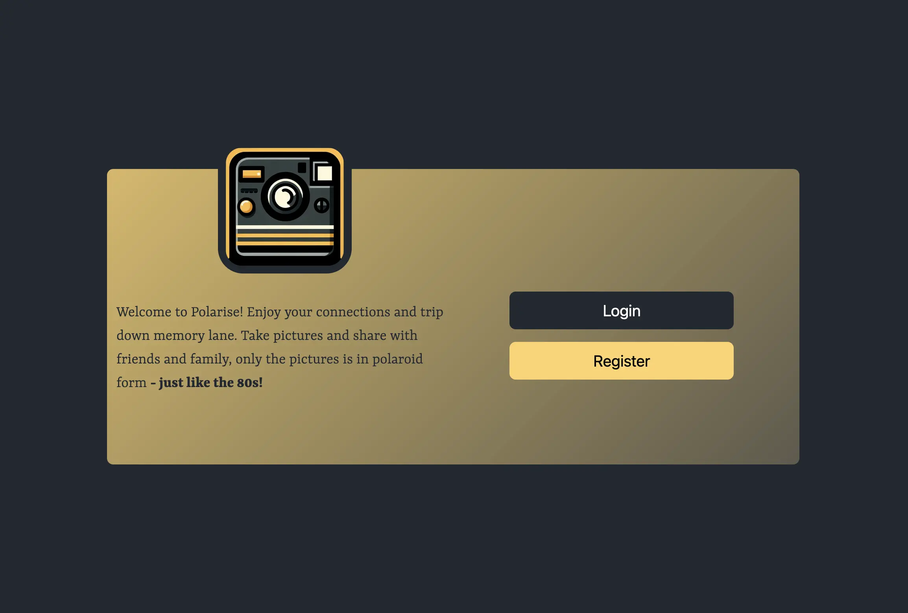

# JS2



## 🎯 **Project Goal**

To apply knowledge of JavaScript techniques to implement the front-end functionality for a social media application.

## 📝 **Project Brief**
You have been tasked with producing a new JavaScript front-end client for an existing social media platform. The client application must be attractive and responsive, but you have an otherwise blank slate in terms of theme design language.

Using the provided API and API documentation, create a functioning user interface that allows for viewing, posting, editing and deleting social media content.

Social API routes require both a JWT token and an API Key. You will need to register an account and login to access your token. 

To complete the required features, you will also need to make use of GET, POST, PUT, and DELETE HTTP methods.

---
## 🖥️ **Live Demo**

[Link to live demo](https://js2-jahb.netlify.app/)

---

## 🚀 **Technologies Used**

- **HTML**, **CSS** & **JavaScript** for the front-end development.
- **Bootstrap** for responsive design and UI components.
- **HTML** & **Regex** for validation.
- **LocalStorage** for storing login & registration information.
- **API**: The site interacts with the [Noroff Holidaze API](https://docs.noroff.dev/docs/v1) to manage items data.

---

## 🛠️ **Setup Instructions**

1. Clone the repo:

```bash
git clone https://github.com/jonhavbra87/project_exam_2
```

2. Install the dependencies:

```
npm install
```

## Built With


## 🛠️ **Setup Instructions**

1. Clone the repo:

```bash
git clone https://github.com/jonhavbra87/css-frameworks-ca.git
```
2. Install the dependencies:

```
npm install
```


### Running
Run the app:

```
npm run dev
```

### Bagdes
[](https://app.netlify.com/sites/js2-jahb/deploys)

## How to use the app?

On the landing page, you need to login or register a new user. For registration, you need to have a @noroff.no or @stud.noroff.no email address. After registration, you will be sent to the "/posts/" page (profile page). There you can view the posts of the social media app.
If you want to:

- View single post: Click on the post you want to view.
- Create a new post: In the menu, there is an option "New Post".
- Edit post: You can only edit your own posts. If you click on one of your own posts, you get an "edit" and "delete" button. Choose wisely :smiley:
- Watch your profile: Click on any profile image or in the menu "My Profile"
- Edit profile: Click on the gear icon to edit your Profile.
- Comment on a post: First, go to a post-specific page, then click on the chat icon if you want to leave a comment.
- React on a post: First, go to a post-specific page, then click on the heart icon if you want to leave a reaction.

## Contributing

This is a Noroff Courtse Assignemt for the second exam. I appreciate a peer review if you got the time!


## Contact

<p align="center">
  <a href="https://no.linkedin.com/in/jon-are-haver%C3%A5en-bratt%C3%A5s-5a3805262?trk=people-guest_people_search-card">
     
  </a>
  <a href="https://www.discord.com">
     
  </a>
  <a href="https://www.instagram.com/jonareb87?igsh=MTAwdDEzZHFwMWFjbQ%3D%3D&utm_source=qr">
     
  </a>
  <a href="mailto:kontakt@brattaasutvikling.no">
     
  </a>
</p>

## License

All work in this repository is licensed under the [Creative Commons Attribution-ShareAlike 4.0 International License](https://creativecommons.org/licenses/by-sa/4.0/).
